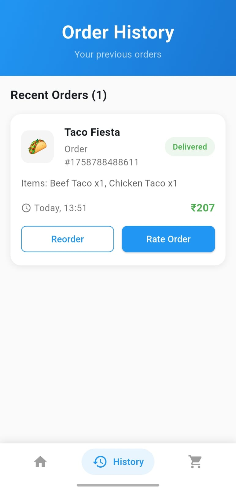

# 🍅 Tomato Food Delivery App

A Flutter food ordering workflow app built with BloC architecture following SOLID principles.

## Screenshots

<!-- Add your app screenshots here -->

| Home Screen | Restaurant Menu | Cart Screen |
|-------------|-----------------|-------------|
|  |  |  |

| Order Confirmation | History Screen | Search Screen |
|-------------------|----------------|---------------|
|  |  |

## Features

- **Restaurant Selection**: Browse available restaurants with ratings and delivery info
- **Menu Browsing**: View restaurant menus with item details and pricing
- **Cart Management**: Add/remove items, update quantities with real-time total calculation
- **Order Placement**: Complete order workflow with error handling
- **Order Confirmation**: Success/failure feedback with order tracking
- **Order History**: View past orders with details
- **Search Functionality**: Find restaurants and menu items

## Application Workflow

### 1. App Launch & Navigation
- App starts with the main navigation screen featuring a bottom navigation bar
- Three main tabs: **Home**, **History**, and **Cart** (with item count badge)
- Smooth tab transitions with animated selection indicators

### 2. Restaurant Discovery (Home Screen)
- **Restaurant List**: Browse available restaurants with ratings, cuisine types, and delivery estimates
- **Restaurant Cards**: Each card displays restaurant image, name, rating, delivery time, and fee
- **Loading States**: Shimmer effects while restaurants load
- **Error Handling**: Retry mechanism for failed restaurant loading

### 3. Menu Exploration
- **Restaurant Details**: Tap any restaurant to view its complete menu
- **Menu Categories**: Items organized by categories (appetizers, mains, desserts, etc.)
- **Item Details**: Each menu item shows image, name, description, and price
- **Add to Cart**: Quick add buttons with quantity selectors
- **Real-time Updates**: Cart icon updates with item count as you add items

### 4. Cart Management
- **Cart Review**: View all selected items with quantities and individual prices
- **Quantity Control**: Increase/decrease item quantities or remove items entirely
- **Price Calculation**: Real-time total calculation including subtotal, delivery fee, and taxes
- **Empty Cart State**: Friendly message when cart is empty with option to browse restaurants
- **Checkout Button**: Proceed to order placement when ready

### 5. Order Placement
- **Order Summary**: Final review of items, quantities, and total amount
- **Payment Processing**: Simulated payment with 10% random failure for testing
- **Loading State**: Progress indicator during order submission
- **Error Handling**: Proper error messages for payment failures with retry options

### 6. Order Confirmation
- **Success State**: Order confirmation with order ID and estimated delivery time
- **Failure State**: Clear error message with option to retry payment
- **Navigation**: Return to home screen or view order history
- **Cart Reset**: Cart automatically clears after successful order

### 7. Order History
- **Past Orders**: View all previous orders with dates and totals
- **Order Details**: Tap any order to see complete item breakdown
- **Order Status**: Track order progress (pending, confirmed, delivered)
- **Reorder Option**: Quick reorder functionality for favorite meals

### 8. Search Functionality
- **Restaurant Search**: Find restaurants by name or cuisine type
- **Menu Search**: Search for specific dishes across all restaurants
- **Filter Options**: Filter by rating, delivery time, or price range
- **Search History**: Quick access to recent searches

## Architecture

### BloC Pattern
- `RestaurantBloc`: Manages restaurant loading and selection
- `CartBloc`: Handles cart operations and state management
- `OrderBloc`: Manages order placement and tracking

### SOLID Principles
- **Single Responsibility**: Each class has one clear purpose
- **Open/Closed**: Repository interfaces allow easy extension
- **Liskov Substitution**: Mock repositories implement interfaces correctly
- **Interface Segregation**: Focused, minimal interfaces
- **Dependency Inversion**: BloCs depend on abstractions, not implementations

### Project Structure
```
lib/
├── models/          # Domain models (Restaurant, Cart, Order)
├── repositories/    # Data layer with interfaces and mock implementations
├── blocs/          # BloC state management
├── screens/        # UI screens
└── main.dart       # App entry point with provider setup
```

## User Journey Flow

```
📱 App Launch
    ↓
🏠 Home Screen (Restaurant List)
    ↓
🍽️ Select Restaurant
    ↓
📋 Browse Menu
    ↓
🛒 Add Items to Cart
    ↓
💰 Review Cart & Totals
    ↓
📝 Place Order
    ↓
💳 Payment Processing
    ↓
✅ Order Confirmation
    ↓
📜 Order History
```

## Error Handling

- Network failures in restaurant loading
- Random payment failures (10% chance for testing)
- Proper error states with retry mechanisms
- User-friendly error messages

## Testing

- Unit tests for all BloCs with success/failure scenarios
- Mocked repositories for isolated testing
- Widget tests for app initialization
- 14 passing tests covering core functionality

## Running the App

```bash
flutter pub get
flutter run
```

## Running Tests

```bash
flutter test
```
